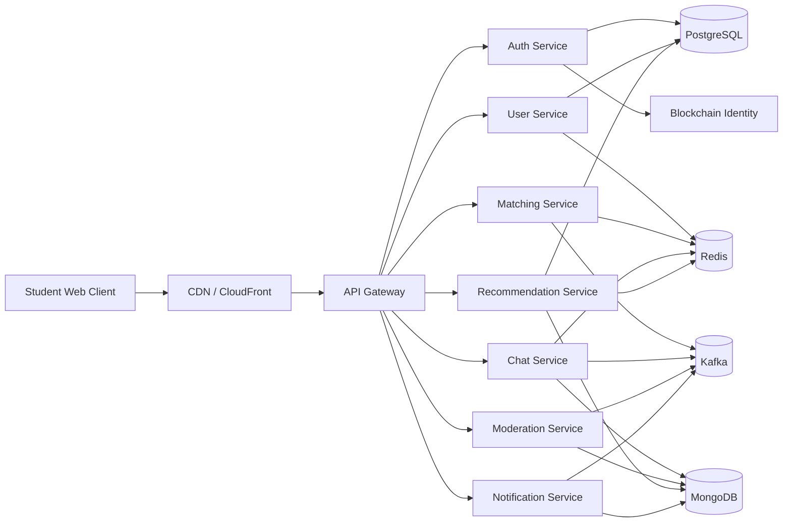
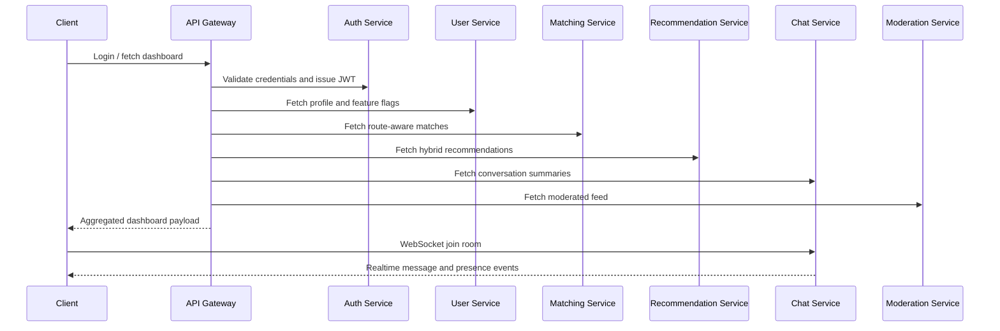

# System Architecture

## Architecture style

CampusConnect+ uses a service-oriented monorepo that can be explained in two equally valid ways:

- As a modular monolith for local development and academic evaluation
- As a microservice-ready architecture because each domain already has isolated runtime boundaries, APIs, deployment units, and its own scaling concerns

The API Gateway is the public entry point. It handles:

- security headers and CORS
- rate limiting
- fan-out aggregation
- retries and fallback responses
- circuit breaker protection around downstream calls

## System architecture diagram

## Data flow diagram

## Service responsibilities

### `auth-service`
- login and refresh token flow
- OAuth redirect bootstrap
- role/permission lookup
- blockchain identity hash verification endpoint

### `user-service`
- profile retrieval and filtering
- location updates with geospatial bucket refresh
- feature flag exposure per user
- directory search surface

### `matching-service`
- route-aware and interest-aware candidate ranking
- live nearby-user lookup using geo-buckets
- async recompute trigger for location or interest changes

### `chat-service`
- conversation summaries
- one-to-one and group messages
- attachment metadata
- read/delivered state transitions
- WebSocket presence and room events

### `moderation-service`
- anonymous post ingestion
- toxicity/safety heuristic filtering
- user reporting
- moderator queue and admin summary

### `recommendation-service`
- people and feed recommendations
- collaborative + content-based explanation
- experiment treatment metadata

### `notification-service`
- async inbox view
- notification creation and read acknowledgement

## Fault tolerance strategy

- Gateway retries transient failures with backoff
- Circuit breaker protects repeated downstream failures
- Gateway falls back to safe cached/demo responses when a service is unavailable
- Realtime UX degrades gracefully when sockets disconnect
- Offline chat sync is modeled as replay from durable storage using cursor-based recovery

## Security posture

- JWT-style auth tokens
- RBAC by role
- rate limiting at the gateway
- secure headers through Helmet
- CORS configured at the edge
- input shaping via typed request bodies and contracts
- anonymous posting separated from authenticated identity

## Why this is not a basic CRUD app

The interesting part of CampusConnect+ is not just storing records. The architecture demonstrates:

- aggregation across services
- realtime messaging and presence
- geospatial matching
- moderation pipelines
- hybrid recommendation logic
- experiments and feature flags
- degraded fallback behavior
- multi-database reasoning and deployment planning
